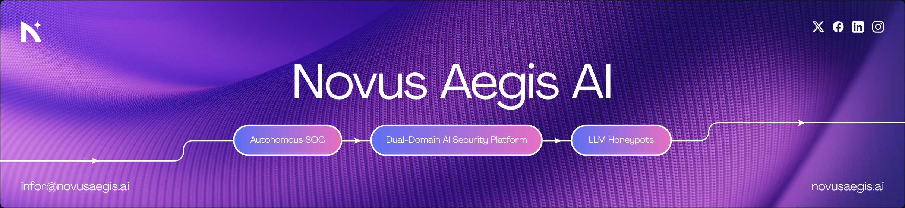
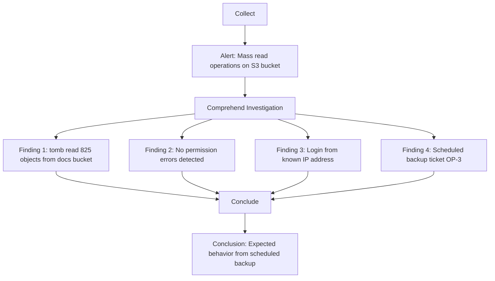

<strong>

<a href="https://www.novusaegis.ai/">Website</a>&nbsp;&nbsp;|&nbsp;&nbsp;<a href="https://www.novusaegis.ai/integrations">Integrations</a>&nbsp;&nbsp;|&nbsp;&nbsp;<a href="https://www.novusaegis.ai/ai-soc-analyst">AI SOC Analyst</a>&nbsp;&nbsp;|&nbsp;&nbsp;<a href="https://www.novusaegis.ai/blog">Blogs</a>&nbsp;&nbsp;|&nbsp;&nbsp;<a href="https://discord.com/invite/HJTtfNrJg">Discord</a>&nbsp;&nbsp;|&nbsp;&nbsp;<a href="https://medium.com/@novusaegis.ai">Medium</a>
  

Novus Aegis AI is an AI-driven cyber deception platform that dynamically deploys intelligent honeypots across cloud environments, captures attacker interactions, and converts them into actionable threat intelligence.

Unlike traditional static honeypots, Novus Aegis AI continuously adapts its deception strategy using threat intelligence feeds, machine learning models, and controlled LLM analysis.

<h2>🎯 Problem Statement</h2>

Modern cybersecurity teams face several challenges :

- Alert fatigue from excessive SIEM notifications
- Increasingly sophisticated AI-driven attacks
- Limited visibility across cloud and endpoint systems
- Slow incident response and investigation workflows
  
Novus Aegis AI addresses these challenges by autonomous AI security agents and adaptive deception techniques.

<h2>🎉 Key Features</h2>

<h2>⌛ Comparison</h2>

| Capability | Dropzone AI | Novus Aegis AI |
|-------------|-------------|----------------|
| Autonomous alert investigations & context memory | ✔️ | ✔️ linked to live decoy sessions |
| Human-in-the-loop review | ✔️ | ✔️ explainable deception traces |
| Integrations (SIEM / EDR / Cloud) | ✔️ | ✔️ IDS/IPS policy control |
| Deception tech (honeypots / canaries) | ❌ | ✔️ LLM-powered decoys, dynamic self-healing |
| Threat actor fingerprinting (live) | ❌ | ✔️ behavior → ATT&CK → actor mapping |
| One-click isolation & network policy | ◐ partial | ✔️ built-in Isolation Controller |
| IR playbooks generated & executed | ❌ | ✔️ workspace docs + approvals |
| Shadow AI governance (prompts / agents / data) | limited | ✔️ discover → classify → guardrail → audit |
| Single pane of glass | ◐ partial | ✔️ investigations + deception + IDS/IPS + IR |
| EU AI Act / ISO 42001 readiness | limited | ✔️ policy mapping + evidence bundles |
| Time to first high-fidelity signal | varies | ✔️ often < 60 minutes |

<h2>⚡ Platform Capability Comparison</h2>

<h2>⚙️ Investigation Workflow</h2>

</strong>

<h2>🤝 Contributing</h2>

We welcome contributions from the security and AI community.

Steps :
1. Fork the repository
2. Create a feature branch
3. Commit your changes
4. Submit a pull request

<h2>📜 License</h2>

This project is licensed under the MIT License. See the LICENSE file for details.
